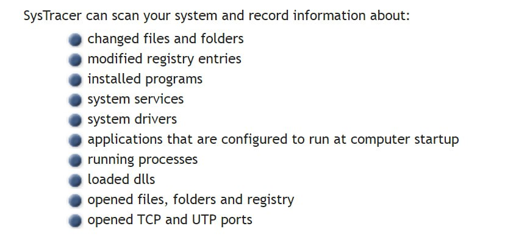
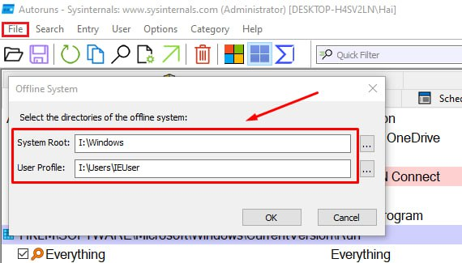

### Systracer

### Autoruns

- Displays auto-starting programs from many places in Windows, including obscure locations like the registry.
Shows the full path and command line for inspection. Helps identify malware or unknown startup entries.
Options to delete, disable, analyze individual entries. Reduces startup time and resource usage.
Easy to use interface with search, filtering and export capabilities.
- Analysis Offline Image After Mount

### Arsenal Image Mounter

- <https://github.com/ArsenalRecon/Arsenal-Image-Mounte>

- <https://mega.nz/file/rg5CXJoK#-rUdbyr1NQll0UrkVAIOQ5km8hD4qMwFIWat4U0OR60>

### Persistence Sniper

- <https://github.com/last-byte/PersistenceSniper>
